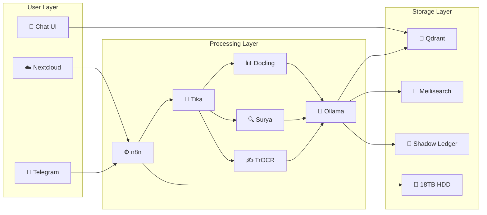

# Neural Orchestrator: Project Master Overview (V3.0)

> **Vision:** A privacy-first, purely local "Internal Google" for 10TB+ of life data. Harnessing the power of AI (Ryzen NPU) to automatically organize, dedup, and index every file, turning a passive hard drive into an active knowledge base.

*Stand: 2025-12-27*

---

## 🏗️ System Architecture: "The Power Plant"

### 1. Hardware Layer (Hybrid)
| Komponente | Rolle | Specs |
| :--- | :--- | :--- |
| **Primary Core** | AMD Ryzen AI 9 HX 370 Mini-PC | 64GB RAM, 4TB NVMe, NPU |
| **Cold Storage** | 18TB HDD (NTFS) | Angeschlossen an Primary Core |
| **Storage Node (Legacy)** | Raspberry Pi 4 | Witness Node, IoT Gateway |

### 2. Network Layer
| Service | Technologie | Zweck |
| :--- | :--- | :--- |
| **Public Access** | Cloudflare Tunnel | Sicherer Zugang zu n8n, Nextcloud |
| **Admin Access** | Tailscale VPN | SSH, internes Management |

---

## 🧠 The "Neural Vault" Stack
    


### Service-Übersicht

| Service | Rolle | Status |
| :--- | :--- | :--- |
| **Nextcloud** | File Interface (Web/Mobile/Desktop) | 🟡 Planned |
| **n8n** | Orchestrator ("Central Nervous System") | 🟢 Active |
| **Apache Tika** | Dateityp-Erkennung (1400+ Formate) | 🟢 Active |
| **IBM Docling** | Dokument-Parsing (Tabellen, Formeln) | 🟡 Planned |
| **Surya OCR** | OCR für gedruckte Dokumente (97.7%) | 🟡 Planned |
| **TrOCR** | OCR für Handschrift (96%) | 🟡 Planned |
| **Ollama** | Lokale LLM-Inferenz (Qwen3:8b) | 🟢 Active |
| **Qdrant** | Vektor-Datenbank (Semantische Suche) | � Active |
| **Meilisearch** | Volltext-Suche (E-Mails, Dokumente) | � Active |
| **SQLite** | Shadow Ledger (Metadaten, Audit) | 🟢 Active |
| **Immich** | Foto/Video-Management (Gesichtserkennung) | 🟡 Planned |

---

## 📂 Zwei-Zonen-Modell

### 🟢 Active Zone: `F:/_Inbox/`
Dateien werden automatisch:
- ✅ Analysiert (OCR, KI-Klassifizierung)
- ✅ Umbenannt (`YYYY-MM-DD_Kategorie_Entity.ext`)
- ✅ Verschoben (in den richtigen Ordner)
- ✅ Indexiert (Qdrant, Shadow Ledger)

**Use Case:** Handy-Fotos, Scans, Downloads, Telegram-Dateien

### 🔵 Passive Zone: `F:/*` (alles andere)
Dateien werden:
- ✅ Indexiert (für Suche)
- ❌ NICHT umbenannt
- ❌ NICHT verschoben

**Use Case:** Bestehendes Archiv, Projektordner, Legacy-Daten

---

## 🔄 Smart Ingestion Pipeline

### Workflow: Neue Datei in `_Inbox`

```
1. 📁 Datei landet in _Inbox
         ↓
2. 🔍 Duplikat-Check (SHA-256)
         ↓ (wenn neu)
3. 📄 Tika: Dateityp + Quick Text
         ↓
4. 🔍 OCR (bei Scans): Surya / TrOCR
         ↓
5. 🤖 Ollama: Klassifizierung + Entities
         ↓
6. ✅ Quality Gates (6 Prüfungen)
         ↓
   ┌─────┴─────┐
   ↓           ↓
✅ PASS    ❌ FAIL
   ↓           ↓
📁 Move    📱 Telegram
to Target    Notify
```

### Quality Gates

| Gate | Prüfung | Schwellenwert |
| :--- | :--- | :--- |
| CATEGORY_PLAUSIBILITY | Passt Kategorie zum MIME-Type? | - |
| FILENAME_QUALITY | Datum-Format, keine Sonderzeichen | - |
| TARGET_FOLDER_VALID | Zielordner existiert | - |
| NO_COLLISION | Keine gleichnamige Datei am Ziel | - |
| CONFIDENCE_THRESHOLD | KI-Konfidenz | ≥ 70% |
| CONTENT_EXTRACTED | Text/Metadaten vorhanden | - |

### Quarantäne-System

| Ordner | Grund |
| :--- | :--- |
| `_Quarantine/_processing_error/` | Verarbeitung fehlgeschlagen |
| `_Quarantine/_low_confidence/` | KI-Konfidenz < 50% |
| `_Quarantine/_review_needed/` | Quality Gate fehlgeschlagen |
| `_Quarantine/_duplicates/` | Exaktes Duplikat (SHA-256) |

---

## 📊 Shadow Ledger (SQLite)

Zentrale Metadaten-Datenbank für alle Dateien:

| Feld | Beschreibung |
| :--- | :--- |
| `sha256` | Eindeutiger Hash |
| `original_filename` | Ursprünglicher Dateiname (erhalten!) |
| `current_filename` | Aktueller Name nach Umbenennung |
| `original_path` | Ursprünglicher Pfad |
| `current_path` | Aktueller Pfad |
| `category` | KI-Klassifizierung |
| `confidence` | KI-Konfidenz (0.0-1.0) |
| `extracted_entities` | JSON mit Vendor, Amount, Date, etc. |
| `status` | pending, indexed, error, quarantined |

---

## 🛤️ Projekt-Tracks

| Track | Fokus | Status |
| :--- | :--- | :--- |
| **TRACK-005** | Neural Vault & Smart Ingestion | � Active |
| **TRACK-004** | Mission Control (React Dashboard) | 🔵 Development |
| **TRACK-003** | Hybrid RAG (Legacy) | ✅ Merged |

---

## 🤖 LLM Auto-Update System

### Aktives Modell: Qwen3:8b

| Eigenschaft | Wert |
| :--- | :--- |
| **Modell** | Qwen3:8b (Alibaba) |
| **Groesse** | 5.2 GB |
| **Konfidenz** | 91% (Durchschnitt) |
| **Geschwindigkeit** | 17.7s pro Datei |
| **Staerken** | Coding, Mathe, Deutsch |

### Woechentliches Auto-Update

Ollama-Modelle werden automatisch jeden **Sonntag um 03:00 Uhr** aktualisiert.

**Windows Scheduled Task:** `NeuralVault-OllamaUpdate`

#### Steuerung

```powershell
# Status anzeigen
F:\conductor\scripts\update_ollama_models.ps1 -Status

# Aktivieren
F:\conductor\scripts\update_ollama_models.ps1 -Enable

# Deaktivieren
F:\conductor\scripts\update_ollama_models.ps1 -Disable

# Test-Benachrichtigung
F:\conductor\scripts\update_ollama_models.ps1 -TestNotification
```

#### Features

- ✅ Windows Toast Notifications (Benachrichtigungs-Center)
- ✅ Fallback wenn F: Laufwerk nicht verfuegbar
- ✅ Automatischer Docker-Start falls noetig
- ✅ Log-Dateien unter `F:\conductor\logs\`
- ✅ UTF-8 Encoding

---

## 📜 Guiding Principles

1. **Privacy First:** Keine Daten verlassen das LAN.
2. **Copy First, Delete Never:** Außer exakte SHA-256 Duplikate.
3. **Git is the Audit Trail:** Configuration as Code.
4. **AI Context is Mandatory:** Jeder Ordner bekommt `_context.md`.
5. **Zwei-Zonen-Modell:** Nur `_Inbox` wird sortiert.
6. **Quality over Speed:** Lieber Quarantäne als falsch sortieren.

---

## 📚 Weiterführende Dokumentation

- [VISION.md](VISION.md) - Projektziele & Non-Goals
- [tech-stack.md](tech-stack.md) - Alle Technologien
- [DATA_STRATEGY_DEEP_DIVE.md](DATA_STRATEGY_DEEP_DIVE.md) - Legacy-Daten Strategie
- [docs/ADR/](docs/ADR/) - Architecture Decision Records
- [docs/runbooks/](docs/runbooks/) - Betriebsanleitungen
- [docs/UAT_PLAN.md](docs/UAT_PLAN.md) - Testplan

---

*Letzte Aktualisierung: 2025-12-27*
