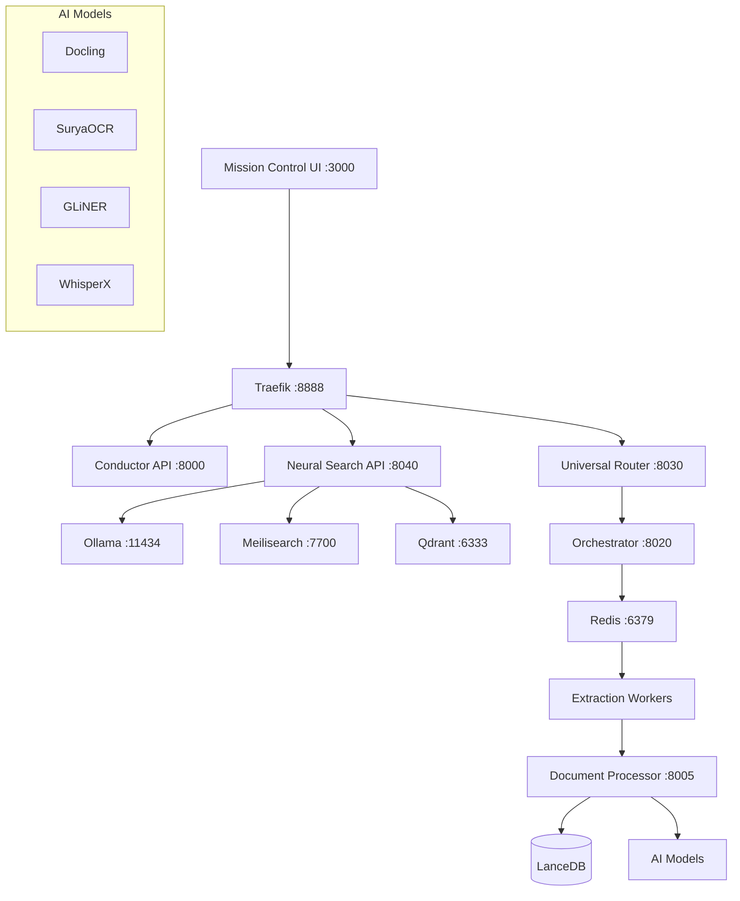

# Conductor

> **Ein lokales, privates "Internes Google" fuer 10TB+ Lebensdaten.**

[]()
[](LICENSE)
[]()
[]()


## 📋 Inhaltsverzeichnis

- [Was ist das?](#was-ist-das)
- [Features](#features)
- [Architektur](#architektur)
- [Benchmarks](#benchmarks)
- [Schnellstart](#schnellstart)
- [Tech Stack](#tech-stack)
- [Dokumentation](#dokumentation)

---

## Was ist das?

Conductor ist ein **vollstaendig lokales** System zur automatischen Organisation, Deduplizierung und semantischen Suche ueber grosse Datenmengen (Dokumente, Fotos, Videos, E-Mails). Es nutzt KI-Modelle (Ollama, WhisperX, Surya OCR), die auf deiner eigenen Hardware laufen - keine Cloud, keine Abos, keine Daten-Leaks.

**Das Kernversprechen:** Finde jede Rechnung, jedes Foto, jede Notiz in unter 3 Sekunden.

---

## Features

- **Neural Search UI** - Perplexity-aehnliche Suchoberflaeche mit KI-generierten Antworten
- **RAG Pipeline** - Retrieval-Augmented Generation mit Quellenverweisen
- **Multi-Modal Processing** - PDF, Audio, Video, Bilder, E-Mails
- **Automatische Klassifizierung** - KI-basierte Dokumentenkategorisierung
- **Volltext & Vektor-Suche** - Meilisearch + Qdrant Hybrid-Suche
- **100% Lokal** - Alle Daten bleiben auf deiner Hardware

---

## Architektur



---

## Benchmarks

Unsere Pipeline ist auf Genauigkeit und Geschwindigkeit optimiert:

| Komponente | Metrik | Wert | Vergleich |
|------------|--------|------|-----------|
| **OCR (Surya)** | Accuracy | **97.7%** | Tesseract: 87% |
| **Tabellen (Docling)** | Accuracy | **97.9%** | Tika: 75% |
| **NER (GLiNER)** | F1-Score | **0.95** | Spacy: 0.85 |
| **Audio (WhisperX)** | Speed | **70x** | Realtime |

---

## Schnellstart

### Voraussetzungen

- Docker Desktop (Windows) oder Docker Engine (Linux)
- NVIDIA GPU mit CUDA (empfohlen fuer OCR/Whisper)
- Mindestens 16GB RAM
- 10TB+ Speicher

### Installation

```bash
# Repository klonen
git clone https://github.com/MasterofMakros/AI-Dataanalyzer-Researcher-.git
cd conductor

# Environment konfigurieren
cp .env.example .env
# .env anpassen (Pfade, API Keys)

# Container starten
docker compose up -d

# Oder mit GPU-Support
docker compose --profile gpu up -d
```

### Services

Nach dem Start sind folgende Services verfuegbar:

| Service | URL | Beschreibung |
|---------|-----|--------------|
| Mission Control | http://localhost:3000 | Web UI (Neural Search) |
| Conductor API | http://localhost:8000 | REST API |
| Meilisearch | http://localhost:7700 | Volltext-Suche |
| Qdrant | http://localhost:6333 | Vektor-Datenbank |
| Ollama | http://localhost:11434 | LLM Backend |

---

## Dokumentation

| Dokument | Beschreibung |
|----------|--------------|
| [ARCHITECTURE.md](ARCHITECTURE.md) | System-Architektur |
| [PROJECT_OVERVIEW_2025.md](PROJECT_OVERVIEW_2025.md) | Projekt-Uebersicht |
| [docs/NEURAL_SEARCH_IMPLEMENTATION.md](docs/NEURAL_SEARCH_IMPLEMENTATION.md) | Neural Search Details |
| [docs/PROJECT_STATUS.md](docs/PROJECT_STATUS.md) | Aktueller Status |

---

## Tech Stack

| Kategorie | Technologie |
|-----------|-------------|
| Frontend | React, TypeScript, Tailwind CSS, shadcn/ui |
| Backend | FastAPI, Python 3.11 |
| Suche | Meilisearch, Qdrant |
| KI/ML | Ollama, WhisperX, Surya OCR, Docling |
| Infrastruktur | Docker, nginx, Redis |

---

## Lizenz

MIT License - siehe [LICENSE](LICENSE)

---

*Letzte Aktualisierung: 2025-12-30*
