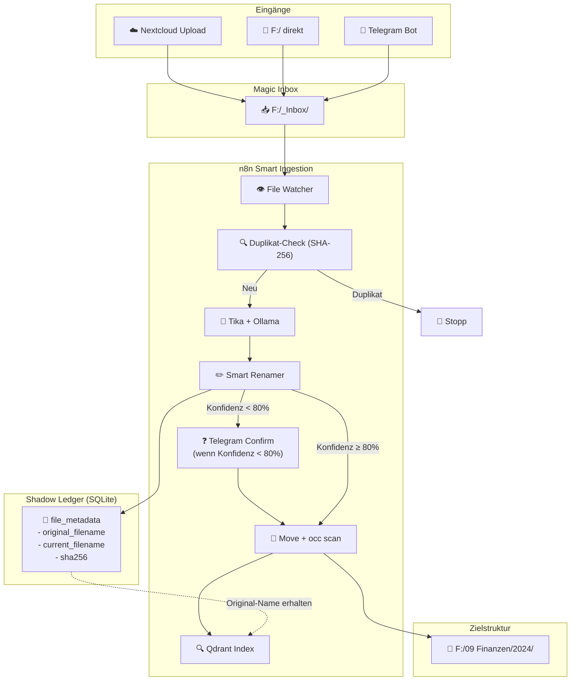

# ADR-006: Nextcloud Integration & Smart Ingestion Pipeline

## Status
**Akzeptiert** (2025-12-26)

## Kontext und Problemstellung

Wir haben ein 10TB Datenarchiv auf Laufwerk F:, das über mehrere Wege zugänglich sein soll:
1.  **Nextcloud** (Web-UI, Sync-Clients, Mobile)
2.  **Direkter Dateizugriff** (Windows Explorer)
3.  **Chat-UI** (für Suche)

Neue Dateien sollen automatisch:
- Analysiert werden (OCR, KI-Kategorisierung)
- **Smart umbenannt** werden (z.B. `IMG_4523.jpg` → `2024-05-12_Rechnung_Bauhaus_45EUR.jpg`)
- In den **richtigen Ordner verschoben** werden
- **Original-Dateiname erhalten bleiben** (für Rückverfolgbarkeit)

### Das Kernproblem
Nextcloud und das Dateisystem müssen synchron bleiben. Wenn n8n eine Datei verschiebt, muss Nextcloud das wissen – sonst zeigt es "Datei nicht gefunden".

---

## Entscheidung

### 1. Architektur: "Shadow Ledger" Pattern



### 2. Zwei-Zonen-Modell: Active vs. Passive

**Kernprinzip:** Nicht alle Dateien sollen automatisch verschoben werden. Nur der `_Inbox` Ordner ist für automatische Sortierung vorgesehen.

```
┌─────────────────────────────────────────────────────────────────┐
│                        LAUFWERK F:/                             │
├─────────────────────────────────────────────────────────────────┤
│                                                                 │
│  ┌─────────────────────────────────────────────────────────┐   │
│  │ 🟢 ACTIVE ZONE: F:/_Inbox/                              │   │
│  │                                                         │   │
│  │  • Dateien werden automatisch ANALYSIERT               │   │
│  │  • Dateien werden automatisch UMBENANNT                │   │
│  │  • Dateien werden automatisch VERSCHOBEN               │   │
│  │  • Original-Name bleibt in Shadow Ledger erhalten      │   │
│  │                                                         │   │
│  │  Ideal für: Handy-Uploads, WhatsApp-Saves, Scans       │   │
│  └─────────────────────────────────────────────────────────┘   │
│                                                                 │
│  ┌─────────────────────────────────────────────────────────┐   │
│  │ 🔵 PASSIVE ZONE: Alles andere (F:/*)                    │   │
│  │                                                         │   │
│  │  • Dateien werden NUR INDEXIERT (Qdrant)               │   │
│  │  • Dateien werden NICHT umbenannt                      │   │
│  │  • Dateien werden NICHT verschoben                     │   │
│  │  • Volle Suchbarkeit, aber keine Änderung              │   │
│  │                                                         │   │
│  │  Ideal für: Archiv, Projekte, Legacy-Daten             │   │
│  └─────────────────────────────────────────────────────────┘   │
│                                                                 │
└─────────────────────────────────────────────────────────────────┘
```

| Zone | Verhalten | Use Case |
| :--- | :--- | :--- |
| **🟢 Active (`_Inbox`)** | Analyse → Rename → Move → Index | Neue Dateien vom Handy, Tablet, Scanner |
| **🔵 Passive (Rest)** | Nur Index (keine Änderung) | Archiv, bestehende Projektordner, 10TB Legacy |

**Warum dieses Modell?**
- **Keine Überraschungen:** Bestehende Ordnerstrukturen bleiben unberührt.
- **Opt-In Sortierung:** Nur was in `_Inbox` landet, wird sortiert.
- **Vollständige Suche:** Auch Dateien in der Passive Zone sind durchsuchbar.

### 2. SQLite Schema: Shadow Ledger

```sql
-- F:\conductor\scripts\schema_shadow_ledger.sql

CREATE TABLE IF NOT EXISTS file_metadata (
    id INTEGER PRIMARY KEY AUTOINCREMENT,
    
    -- Identifikation (unveränderlich)
    sha256 TEXT UNIQUE NOT NULL,
    
    -- Original-Informationen (unveränderlich)
    original_path TEXT NOT NULL,
    original_filename TEXT NOT NULL,
    original_extension TEXT NOT NULL,
    
    -- Aktuelle Informationen (ändern sich bei Verschiebungen)
    current_path TEXT NOT NULL,
    current_filename TEXT NOT NULL,
    
    -- Klassifizierung
    category TEXT,                    -- z.B. "Finanzen/Rechnung"
    subcategory TEXT,                 -- z.B. "Eingangsrechnung"
    confidence REAL,                  -- 0.0 - 1.0
    
    -- Extrahierte Entitäten (JSON)
    extracted_entities TEXT,          -- {"vendor": "Bauhaus", "amount": 45.00, "date": "2024-05-12"}
    
    -- Volltext (für lokale Suche)
    extracted_text TEXT,
    
    -- Timestamps
    file_created_at DATETIME,         -- Ursprüngliches Erstelldatum der Datei
    ingested_at DATETIME DEFAULT CURRENT_TIMESTAMP,
    processed_at DATETIME,
    moved_at DATETIME,
    
    -- Status
    status TEXT DEFAULT 'pending',    -- pending, processing, indexed, archived, error
    error_message TEXT,
    
    -- Externe IDs
    qdrant_point_id TEXT,
    nextcloud_file_id INTEGER,
    
    -- Audit
    processing_duration_ms INTEGER,
    processed_by TEXT DEFAULT 'n8n'
);

-- Indizes für schnelle Suche
CREATE INDEX IF NOT EXISTS idx_sha256 ON file_metadata(sha256);
CREATE INDEX IF NOT EXISTS idx_original_filename ON file_metadata(original_filename);
CREATE INDEX IF NOT EXISTS idx_current_path ON file_metadata(current_path);
CREATE INDEX IF NOT EXISTS idx_category ON file_metadata(category);
CREATE INDEX IF NOT EXISTS idx_status ON file_metadata(status);
CREATE INDEX IF NOT EXISTS idx_ingested_at ON file_metadata(ingested_at);

-- View für "Was wurde wohin verschoben?"
CREATE VIEW IF NOT EXISTS v_file_moves AS
SELECT 
    original_filename,
    current_filename,
    original_path,
    current_path,
    category,
    ingested_at,
    moved_at
FROM file_metadata
WHERE original_path != current_path
ORDER BY moved_at DESC;
```

### 3. Nextcloud External Storage Konfiguration

**Option A: Nextcloud config.php (Native Installation)**
```php
'files_external' => true,
// Dann in Admin-Panel: External Storage → Local → F:\
```

**Option B: Docker Compose (Empfohlen)**
```yaml
# docker-compose.nextcloud.yml
services:
  nextcloud:
    image: nextcloud:28-apache
    container_name: nextcloud
    volumes:
      # Nextcloud-interne Daten
      - nextcloud_data:/var/www/html
      # KRITISCH: Das 10TB Laufwerk F: mounten
      - F:/:/external/DataPool:rw
    environment:
      - NEXTCLOUD_TRUSTED_DOMAINS=localhost,nextcloud.gigsolutions.info
    restart: unless-stopped

volumes:
  nextcloud_data:
```

**Nach dem Start: External Storage aktivieren**
```bash
docker exec -u www-data nextcloud php occ app:enable files_external
docker exec -u www-data nextcloud php occ files_external:create \
    "DataPool" local null::null \
    -c datadir=/external/DataPool \
    --user=admin
```

### 4. n8n Workflow: Smart Ingestion

**Trigger: File Watcher (alle 60 Sekunden)**
```json
{
  "nodes": [
    {
      "name": "Watch _Inbox",
      "type": "n8n-nodes-base.localFileTrigger",
      "parameters": {
        "path": "F:/_Inbox",
        "events": ["add", "change"],
        "awaitWriteFinish": true,
        "awaitWriteFinishTimeout": 5000
      }
    }
  ]
}
```

**Post-Move: Nextcloud Sync**
```json
{
  "name": "Nextcloud Rescan",
  "type": "n8n-nodes-base.executeCommand",
  "parameters": {
    "command": "docker exec -u www-data nextcloud php occ files:scan --path='/external/DataPool' --shallow"
  }
}
```

### 5. Smart Rename Logik

```python
# Pseudo-Code für den Renamer

def generate_smart_filename(analysis_result, original_filename):
    """
    Generiert einen strukturierten Dateinamen basierend auf der Analyse.
    
    Format: YYYY-MM-DD_Kategorie_Entität_Beschreibung.ext
    Beispiel: 2024-05-12_Rechnung_Bauhaus_Gartenmaterial.pdf
    """
    date = analysis_result.get('date') or datetime.now().strftime('%Y-%m-%d')
    category = analysis_result.get('category', 'Unsortiert')
    entity = analysis_result.get('entity', '')[:30]  # Max 30 Zeichen
    description = analysis_result.get('description', '')[:50]
    extension = Path(original_filename).suffix
    
    # Sonderzeichen entfernen
    safe_entity = sanitize_filename(entity)
    safe_description = sanitize_filename(description)
    
    parts = [date, category]
    if safe_entity:
        parts.append(safe_entity)
    if safe_description:
        parts.append(safe_description)
    
    new_name = '_'.join(parts) + extension
    return new_name


def determine_target_folder(category, date):
    """
    Bestimmt den Zielordner basierend auf Kategorie und Datum.
    """
    category_mapping = {
        'Rechnung': '09 Datenpool Finanzen/Eingangsrechnungen',
        'Kontoauszug': '09 Datenpool Finanzen/Kontoauszüge',
        'Vertrag': '08 Datenpool Rechtliches/Verträge',
        'Foto': '07 Datenpool Persönlich/Fotos',
        'Projekt': '09 Datenpool Projekte',
    }
    
    base_folder = category_mapping.get(category, '99 Datenpool Archiv/Unsortiert')
    year = date[:4] if date else str(datetime.now().year)
    
    return f"F:/{base_folder}/{year}/"
```

---

## Begründung

### Warum "Shadow Ledger" statt nur Dateisystem?

| Aspekt | Nur Dateisystem | Mit Shadow Ledger |
| :--- | :--- | :--- |
| **Original-Dateiname** | ❌ Verloren nach Rename | ✅ Gespeichert in `original_filename` |
| **Suche nach altem Namen** | ❌ Nicht möglich | ✅ `WHERE original_filename LIKE '%IMG%'` |
| **Duplikat-Erkennung** | ❌ Nur über Dateiname | ✅ SHA-256 Hash |
| **Audit-Trail** | ❌ Keine Historie | ✅ Vollständige Bewegungshistorie |
| **Sync mit Nextcloud** | ⚠️ Manuell | ✅ Automatisiert via `occ scan` |

### Warum Nextcloud External Storage statt Nextcloud Data?

| Aspekt | Nextcloud Data (intern) | External Storage |
| :--- | :--- | :--- |
| **Datei-Zugriff** | Nur via Nextcloud | Direkt + Nextcloud |
| **10TB Support** | ⚠️ Performance-Probleme | ✅ Optimal für große Volumes |
| **n8n Zugriff** | ❌ Kompliziert | ✅ Direkter Dateizugriff |
| **Backup** | Nextcloud-spezifisch | Standard-Filesystem-Backup |

---

## Konsequenzen

### Positiv
- ✅ Original-Dateiname bleibt erhalten (Rückverfolgbarkeit)
- ✅ Dateien sind über Nextcloud UND direkt zugänglich
- ✅ Automatische Sortierung ohne manuellen Aufwand
- ✅ Volltextsuche über alle Dokumente

### Negativ
- ⚠️ `occ files:scan` muss nach jedem Move ausgeführt werden
- ⚠️ SQLite-Datenbank ist zusätzliche Komponente (muss gesichert werden)
- ⚠️ Bei Konfidenz < 80% wird User via Telegram gefragt (Unterbrechung)

### Neutral
- Erfordert Docker-Setup für Nextcloud
- n8n Workflow muss implementiert werden

---

## Alternativen (abgelehnt)

| Alternative | Grund für Ablehnung |
| :--- | :--- |
| **Dateien nicht umbenennen** | Verliert den Nutzen der "Smart Organization" |
| **Nur in Metadaten umbenennen** | User sieht im Explorer den alten Namen → Verwirrung |
| **Nextcloud Workflow App** | Zu limitiert für komplexe KI-Analyse |
| **Syncthing statt Nextcloud** | Keine Web-UI, kein Multi-User |

---

## Compliance-Check

| Frage | Antwort |
| :--- | :--- |
| Passt zur Vision (VISION.md)? | ✅ Ja - "Zero-Touch Organization" |
| Verstößt gegen Non-Goals? | ✅ Nein |
| Erfordert Runbook-Update? | ✅ Ja → RUNBOOK-001 erstellen |

---

## Verknüpfte Dokumente

- [ADR-004: Document ETL Pipeline](./ADR-004-document-etl.md)
- [ADR-005: OCR Strategy](./ADR-005-ocr-strategy.md)
- [RUNBOOK-001: Nextcloud Setup](../runbooks/RUNBOOK-001-nextcloud-setup.md)
- [PROJECT_OVERVIEW_2025.md](../PROJECT_OVERVIEW_2025.md)
