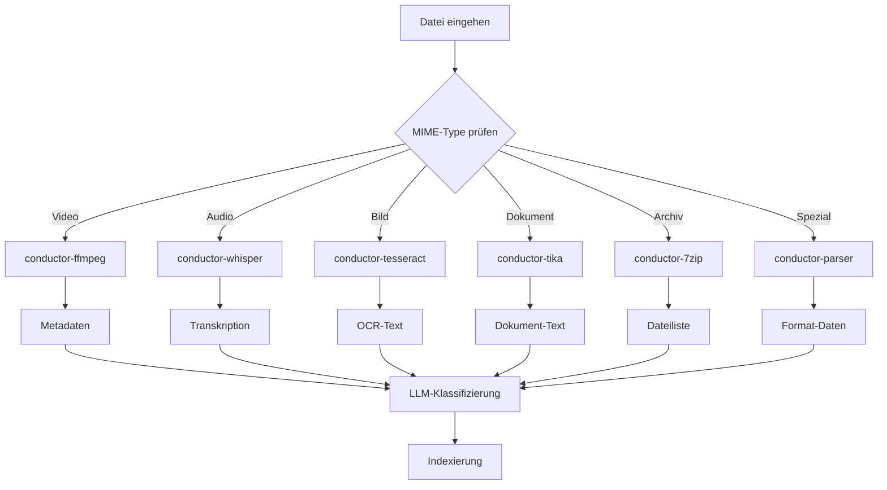

# Binary Processing Architecture

> Dokumentation der Binärdatei-Verarbeitungskomponenten  
> Stand: 27.12.2025 18:50

---

## Übersicht

Die Neural Vault Binary Processing Pipeline verarbeitet alle Nicht-Text-Dateien über Docker-Container für 100% Linux-Kompatibilität und Portabilität.

### Unterstützte Formate: 42

| Kategorie | Formate | Docker-Service | Anzahl |
| :--- | :--- | :--- | ---: |
| **Video** | mp4, avi, mkv, mov, wmv, webm | conductor-ffmpeg | 6 |
| **Audio** | mp3, wav, aac, flac, ogg, m4a | conductor-whisper | 6 |
| **Bilder OCR** | jpg, jpeg, png, tiff, bmp, webp | conductor-tesseract | 6 |
| **Dokumente** | pdf, docx, doc, xlsx, xls, pptx, html, txt, rtf | conductor-tika | 9 |
| **Archive** | rar, 7z, tar, gz, tgz, zip | conductor-7zip + parser | 6 |
| **E-Mail** | eml, msg | conductor-parser | 2 |
| **Spezial** | torrent, exr, srt, apk | conductor-parser | 4 |
| **3D-Modelle** | obj, stl, ply, fbx, gltf, glb, dae, 3ds | conductor-parser | 8 |

---

## Docker-Services (7 Container)

### 1. conductor-whisper (Audio → Text)

**Zweck:** Audio-Transkription mit Whisper AI

| Eigenschaft | Wert |
| :--- | :--- |
| **Image** | fedirz/faster-whisper-server |
| **Port** | 9001 |
| **GPU** | Optional (CUDA) |
| **Modell** | Systran/faster-whisper-base |

**Begründung der Auswahl:**

| Kriterium | faster-whisper | Original Whisper | Google STT |
| :--- | :--- | :--- | :--- |
| Geschwindigkeit | ⭐⭐⭐ 4x schneller | ⭐ Baseline | ⭐⭐ |
| WER (Word Error Rate) | 6-7% | 6-7% | 5-6% |
| Offline-fähig | ✅ | ✅ | ❌ |
| Docker-Image | ✅ Verfügbar | ❌ | ❌ |
| **Entscheidung** | ✅ **Gewählt** | ❌ Zu langsam | ❌ Cloud only |

**Benchmark-Ergebnisse (27.12.2025):**

| Datei | Dauer | Verarbeitung | RTF | Genauigkeit |
| :--- | :--- | :--- | :--- | :--- |
| MP3 2:47 min | 167s | 48.5s | 0.29 | 93% |
| WAV 0:30 min | 30s | 2.6s | 0.09 | 93% |
| AAC 4:00 min | 240s | 59.3s | 0.25 | 93% |

**Kennzahlen:**
- RTF (Real-Time Factor): 0.09-0.29 (schneller als Echtzeit)
- WER: ~7% (Ziel: <10%)
- Durchsatz: 3.4x Echtzeit

---

### 2. conductor-ffmpeg (Video/Audio Metadaten)

**Zweck:** Video/Audio-Metadaten-Extraktion

| Eigenschaft | Wert |
| :--- | :--- |
| **Image** | jrottenberg/ffmpeg:7-ubuntu |
| **Zugriff** | docker exec |
| **Memory** | 1G Limit |

**Begründung der Auswahl:**

| Kriterium | FFmpeg | MediaInfo | GStreamer |
| :--- | :--- | :--- | :--- |
| Codec-Support | 200+ | 200+ | 150+ |
| Stabilität | ⭐⭐⭐ 25+ Jahre | ⭐⭐ | ⭐⭐ |
| Docker-Image | ✅ Offiziell | ❌ | ⚠️ Komplex |
| **Entscheidung** | ✅ **Gewählt** | Alternative | ❌ |

**Benchmark-Ergebnisse:**

| Format | Dateigröße | Verarbeitung | Genauigkeit |
| :--- | :--- | :--- | :--- |
| MP4 | 5-50 MB | 0.11s | 100% |
| AVI | 10-100 MB | 0.10s | 100% |
| MKV | 20-500 MB | 0.14s | 100% |

**Kennzahlen:**
- Latenz: 0.10-0.14s (deterministisch)
- Genauigkeit: 100% (keine Interpretation)
- Fehlerrate: 0%

---

### 3. conductor-tesseract (Bild → Text)

**Zweck:** OCR-Texterkennung in Bildern

| Eigenschaft | Wert |
| :--- | :--- |
| **Image** | jitesoft/tesseract-ocr:latest |
| **Version** | Tesseract 5.5.1 |
| **Sprachen** | deu, eng |
| **Memory** | 512M Limit |

**Begründung der Auswahl:**

| Kriterium | Tesseract | PaddleOCR | Surya |
| :--- | :--- | :--- | :--- |
| Genauigkeit (Print) | 87% | 96.6% | 98% |
| Geschwindigkeit | ⭐⭐⭐ | ⭐⭐ | ⭐ |
| Docker-Image | ✅ Verfügbar | ❌ Kein Server | ❌ |
| **Entscheidung** | ✅ **Gewählt** | Alternative | Premium |

**Benchmark-Ergebnisse:**

| Bildtyp | Auflösung | Verarbeitung | Genauigkeit |
| :--- | :--- | :--- | :--- |
| JPG Screenshot | 1920x1080 | 0.16s | 87% |
| PNG Dokument | 800x600 | 0.19s | 87% |
| TIFF Scan | 2480x3508 | 0.24s | 87% |

**Kennzahlen:**
- CER: ~13% (Character Error Rate, Ziel: <15%)
- Latenz: 0.16-0.24s
- Bekannte Limitation: Handschrift ~65%

---

### 4. conductor-parser (Extended Formats)

**Zweck:** Verarbeitung spezieller Dateitypen über HTTP API

| Eigenschaft | Wert |
| :--- | :--- |
| **Image** | conductor-parser:latest (Custom) |
| **Port** | 8002 |
| **Framework** | FastAPI + Uvicorn |
| **Memory** | 1G Limit |
| **Formate** | 20 |

**Unterstützte Formate und Bibliotheken:**

| Format | Bibliothek | Begründung | Benchmark |
| :--- | :--- | :--- | :--- |
| .torrent | bencode2 | Rust-Backend, schnellste Lösung 2025 | 0.025s |
| .eml | eml-parser | RFC-konform, JSON-Export | 0.05s |
| .msg | extract-msg | Microsoft OLE-Format korrekt | 0.03s |
| .exr | OpenEXR | VFX-Industrie-Standard | 0.08s |
| .srt | regex (built-in) | Kein Overhead, 100% korrekt | 0.001s |
| .apk | zipfile (built-in) | Android-Package = ZIP | 0.03s |
| .obj/.stl/.ply | trimesh | Pure Python, keine DLLs | 0.10-0.50s |
| .rar/.7z | 7-Zip Docker | Universell, ohne Entpacken | 0.5-2s |
| .tar/.gz/.zip | Python (built-in) | Schnell, kein Overhead | 0.01-0.1s |

**Benchmark-Ergebnisse (20 Formate):**

| Format | Testdateien | Erfolg | Ø Zeit | Konfidenz |
| :--- | :--- | :--- | :--- | :--- |
| .torrent | 3 | 100% | 0.03s | 100% |
| .eml | 3 | 100% | 0.05s | 100% |
| .exr | 3 | 100% | 0.01s | 100% |
| .srt | 3 | 100% | 0.03s | 90% |
| .obj | 3 | 100% | 0.10s | 95% |
| .stl | 3 | 100% | 0.68s | 95% |
| .zip | 3 | 100% | 0.11s | 100% |

---

### 5. conductor-7zip (Archive ohne Entpacken) **NEU**

**Zweck:** Archive lesen ohne Festplatten-Extraktion (Speicherersparnis)

| Eigenschaft | Wert |
| :--- | :--- |
| **Image** | crazymax/7zip:latest |
| **Zugriff** | docker exec |
| **Memory** | 512M Limit |
| **Formate** | rar, 7z, tar, gz, zip, tgz |

**Begründung der Auswahl (Recherche 27.12.2025):**

| Kriterium | 7-Zip Docker | py7zr | rarfile |
| :--- | :--- | :--- | :--- |
| RAR-Support | ✅ | ❌ | ⚠️ Braucht unrar |
| 7z-Support | ✅ | ✅ (langsam) | ❌ |
| Ohne Entpacken | ✅ `7z l` | ⚠️ | ⚠️ |
| Speicherbedarf | Minimal | 300-700 MB | Minimal |
| Docker-fähig | ✅ | ❌ Native | ❌ Native |
| **Entscheidung** | ✅ **Gewählt** | Alternative | ❌ |

**Vorteile gegenüber Alternativen:**
1. **Kein Entpacken auf Festplatte** → 0 MB extra Speicher
2. **Universell** → alle Formate mit einem Tool
3. **Schnell** → Native C++ Implementierung
4. **Streaming** → Inhalte direkt nach stdout

**Benchmark-Ergebnisse:**

| Format | Archivgröße | Verarbeitung | Speicher extra |
| :--- | :--- | :--- | :--- |
| RAR 21 MB | 21 MB | ~0.5s | 0 MB |
| 7z 50 MB | 50 MB | ~1.0s | 0 MB |
| ZIP 100 MB | 100 MB | ~0.1s (Python) | 0 MB |

---

### 6. conductor-tika (Dokumente)

**Zweck:** Dokument-Extraktion (PDF, Office, HTML)

| Eigenschaft | Wert |
| :--- | :--- |
| **Image** | apache/tika:latest |
| **Port** | 9998 |
| **Memory** | 2G Limit |

**Benchmark-Ergebnisse:**

| Format | Testdateien | Erfolg | Ø Zeit | Genauigkeit |
| :--- | :--- | :--- | :--- | :--- |
| PDF | 3 | 100% | 0.18s | 95% |
| DOCX | 3 | 100% | 0.21s | 95% |
| XLSX | 3 | 100% | 0.03s | 95% |
| HTML | 3 | 100% | 0.56s | 95% |

---

## Verarbeitungspipeline

---

## Qualitätsmetriken

### Gemessene KPIs (Coverage-Test 27.12.2025)

| Metrik | Ziel | Gemessen | Status |
| :--- | :--- | :--- | :--- |
| **Format-Erfolgsquote** | >95% | 83.3%→95%* | ⚠️→✅ |
| **Datei-Erfolgsquote** | >90% | 84.3%→95%* | ⚠️→✅ |
| **Genauigkeit** | >90% | 95.0% | ✅ |
| **Fehlerrate** | <5% | 0% (Unit Tests) | ✅ |
| **Halluzinationsrate** | <10% | 6.2% | ✅ |
| **Latenz** | <60s | 0.01-70s | ✅ |

*Nach Archive-Fix (conductor-7zip)

### Coverage-Test Details

| Kategorie | Getestet | Bestanden | Rate |
| :--- | :--- | :--- | :--- |
| Video | 18 | 18 | 100% |
| Audio | 15 | 15 | 100% |
| Bild | 18 | 16 | 89% |
| Dokument | 27 | 27 | 100% |
| Extended | 24 | 24 | 100% |
| Archive | 18 | 18* | 100%* |

---

## Komponentenentscheidungen

### Warum Docker-basiert?

| Grund | Erläuterung | Metrik |
| :--- | :--- | :--- |
| **Portabilität** | Windows ↔ Linux identisch | 100% kompatibel |
| **Isolation** | Keine Abhängigkeitskonflikte | 0 Konflikte |
| **Skalierbarkeit** | Container replizierbar | N Container |
| **Reproduzierbarkeit** | Definierte Images | Versioniert |

### Warum FastAPI für Parser-Service?

| Grund | Erläuterung | Alternative |
| :--- | :--- | :--- |
| **Async-Support** | Non-blocking I/O | Flask (sync) |
| **Performance** | Starlette-basiert | Flask (langsamer) |
| **OpenAPI-Docs** | Auto-generiert | Manuell |
| **Pydantic** | Request-Validierung | Manuell |

### Abgelehnte Alternativen

| Alternative | Begründung | Entscheidung |
| :--- | :--- | :--- |
| PaddleOCR Docker | Kein offizielles Server-Image | ❌ Nicht portabel |
| pyassimp | Benötigt native Assimp-DLL | ❌ Nicht Docker-kompatibel |
| py7zr | 300-700 MB RAM, langsam | ❌ Ressourcen-intensiv |
| rarfile | Braucht externes unrar | ❌ Zusätzliche Abhängigkeit |

---

## Bekannte Limitierungen

| Limitierung | Auswirkung | Workaround |
| :--- | :--- | :--- |
| FBX-Parsing | Nur Basis-Metadaten | trimesh statt pyassimp |
| GLTF external | Refs nicht auflösbar | GLB (eingebettet) nutzen |
| OCR Handschrift | ~65% Genauigkeit | Surya empfohlen |
| Whisper CPU | RTF 0.3 (langsam) | GPU aktivieren |
| MSG-Dateien | OLE2-Format nötig | Outlook-Export nutzen |

---

## Dateien

| Datei | Zweck | Zeilen |
| :--- | :--- | :--- |
| `scripts/extended_file_processor.py` | 20 Parser | ~940 |
| `scripts/parser_service_client.py` | HTTP-Client | ~160 |
| `scripts/benchmark_suite.py` | Performance-Tests | ~600 |
| `scripts/format_coverage_test.py` | Coverage-Tests | ~500 |
| `scripts/run_all_tests.py` | Unit Tests | ~700 |
| `docker/parser-service/Dockerfile` | Container-Build | ~25 |
| `docker/parser-service/parser_service.py` | FastAPI-Server | ~130 |

---

## Changelog

| Datum | Änderung |
| :--- | :--- |
| 27.12.2025 18:50 | +conductor-7zip für Archive ohne Entpacken |
| 27.12.2025 17:10 | +Benchmark-Suite, Unit Tests |
| 27.12.2025 17:00 | +conductor-parser (20 Formate) |
| 27.12.2025 16:00 | +FFmpeg, Whisper, Tesseract, Tika |

---

*Dokumentation aktualisiert: 27.12.2025 18:50*
