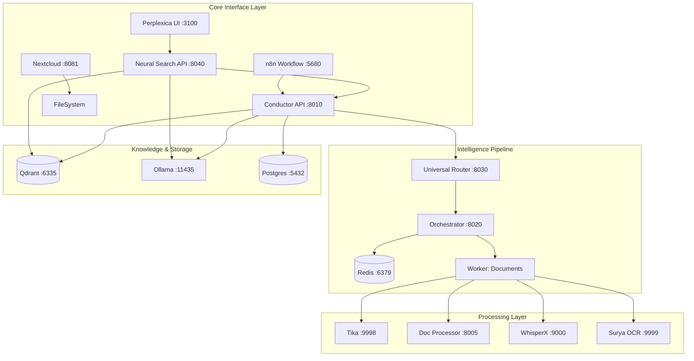

# Docker Architecture

> Neural Vault Docker-based Architecture
> Status: v3.38.0 (Production Ready) - 2026-01-18

---

## Service Overview

Neural Vault consists of **18+ Docker containers** communicating via an internal bridge network (`conductor-net`).



---

## Container Details

| Service | Image | Ext. Port | Int. Port | Memory | Function |
|:--------|:------|:----------|:----------|:-------|:---------|
| **conductor-api** | `conductor-api` | 8010 | 8000 | 512M | Central REST API |
| **perplexica** | `perplexica-neural-vault` | 3100 | 3000 | 1G | **Search UI** (RAG Frontend) |
| **neural-search** | `neural-search-api` | 8040 | 8040 | 512M | RAG Logic & LLM Synthesis |
| **universal-router** | `conductor-universal-router` | 8030 | 8030 | 256M | Magic Byte Detection / Routing |
| **orchestrator** | `conductor-orchestrator` | 8020 | 8020 | 256M | Job Queue Management (Redis) |
| **document-processor** | `conductor-document-processor` | 8005 | 8000 | 4G | Docling / GLiNER / Layout Analysis |
| **whisperx** | `conductor-whisperx` | 9000 | 9000 | 4G | Audio Transcription (CPU/GPU) |
| **surya-ocr** | `conductor-surya-ocr` | 9999 | 8000 | 4G | High-Res OCR |
| **tika** | `apache/tika` | 9998 | 9998 | 1G | Standard Text Extraction |
| **nextcloud** | `nextcloud:30` | 8081 | 80 | 512M | File Synchronization |
| **n8n** | `n8nio/n8n` | 5680 | 5678 | 768M | Workflow Automation |
| **qdrant** | `qdrant/qdrant` | 6335 | 6333 | 1G | Vector Database |
| **ollama** | `ollama/ollama` | 11435 | 11434 | 8G | Local LLM Inference |
| **redis** | `redis:7.4` | 6379 | 6379 | 128M | Message Broker / State |
| **postgres** | `postgres:16` | - | 5432 | 256M | Relational DB (n8n) |
| **traefik** | `traefik:v3` | 8888 | 8888 | 128M | Reverse Proxy / Dashboard |

---

## Volume Mappings

Configuration is handled via `.env` using the `CONDUCTOR_ROOT` variable.

| Volume | Host Path | Internal Path | Purpose |
|:-------|:----------|:--------------|:--------|
| **Primary Data** | `${CONDUCTOR_ROOT}` | `/mnt/data:ro` | Main Data Pool (Read-Only to services) |
| **Inbox** | `${CONDUCTOR_INBOX}` | `/mnt/inbox` | New file intake |
| **Perplexica** | `perplexica_data` | `/home/perplexica/data` | Chat History & Settings |
| **Qdrant** | `qdrant_data` | `/qdrant/storage` | Vector Index |
| **Ollama** | `ollama_data` | `/root/.ollama` | LLM Models |

---

## Quickstart

### 1. Prerequisites
*   Docker Desktop (Windows/Mac) or Docker Engine (Linux)
*   16GB+ RAM recommmended

### 2. Configuration
Navigate to the project directory:
```bash
cd C:\Users\Admin\Desktop\AI-Dataanalyzer-Researcher-
```

Create environment file:
```bash
# Windows
Copy-Item .env.example .env
# Edit .env and set CONDUCTOR_ROOT to your data path
```

### 3. Start Services
```bash
# CPU Mode (Default)
docker compose --profile cpu up -d

# GPU Mode (NVIDIA Only)
docker compose --profile gpu up -d
```

### 4. Verification
Run the validation suite:
```bash
./scripts/validate.ps1
```

---

## Network Architecture

All services reside in `conductor-net` (bridge).

*   **Internal Communication:** Uses service names (e.g., `http://ollama:11434`).
*   **External Access:** Mapped to localhost ports (e.g., `http://localhost:3100`).

For detailed architectural decisions, see `docs/ADR/`.
