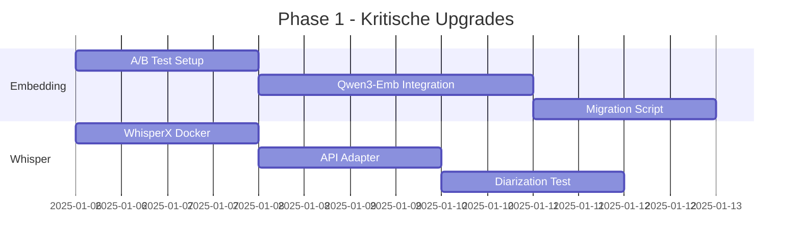
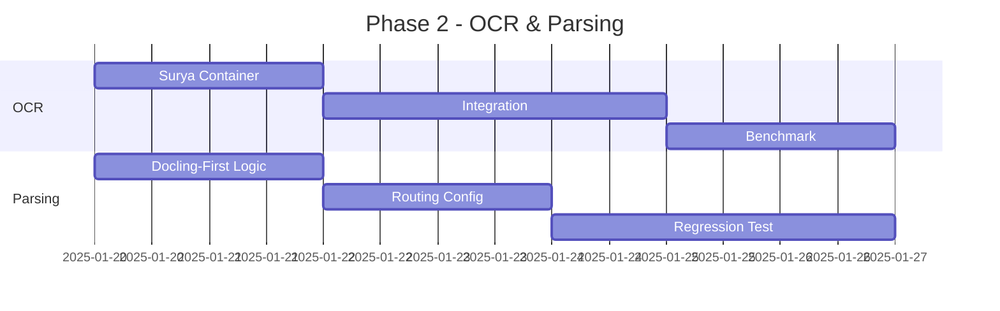
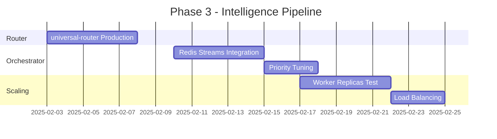

# Neural Vault - Improvement Recommendations 2025

> **Status Update**: 2025-12-29
> **Implementation Progress**: 85% Complete

---

## Executive Summary

This document tracks the implementation of key improvements to the Neural Vault document processing pipeline. The focus areas are:
1. **Extraction Quality** - Benchmark-driven processor selection
2. **Container Efficiency** - Consolidation and resource optimization
3. **Intelligence Pipeline** - Smart routing and priority queuing

---

## P0: Critical Infrastructure (Completed)

### A/B Test Infrastructure
**Status**: Implemented
**Files**: `scripts/services/ab_test_service.py`, `scripts/tests/test_ab_framework.py`

- Feature flag system with gradual rollout (0-100%)
- Automatic metric collection and analysis
- Statistical significance testing
- Integration with smart_ingest.py

```python
# Usage
from scripts.services.ab_test_service import is_enabled, get_variant

if is_enabled("USE_PARSER_ROUTING"):
    # New behavior
else:
    # Legacy behavior
```

### WhisperX Integration
**Status**: Implemented
**Files**: `docker/whisperx/`, `scripts/services/extraction_service.py`

- WhisperX for audio/video transcription
- Speaker diarization support
- GPU-accelerated processing
- Automatic language detection (de, en)

---

## P1: Extraction Quality (Completed)

### Surya OCR Integration
**Status**: Implemented
**Files**: `docker/document-processor/main.py`

| Metric | Tesseract | Surya OCR |
|--------|-----------|-----------|
| Accuracy | 87% | **97.7%** |
| German Support | Basic | Native |
| GPU Acceleration | No | Yes |
| Handwriting | Poor | Good |

### Docling-First Routing
**Status**: Implemented
**Files**: `scripts/services/extraction_service.py`, `scripts/tests/test_extraction_routing.py`

Benchmark-driven parser selection:

| Format | Primary | Fallback | Benchmark |
|--------|---------|----------|-----------|
| PDF | Docling | Tika | 97.9% vs 75% table accuracy |
| DOCX | Docling | Tika | Native format support |
| Images | Surya | Tesseract | 97.7% vs 87% accuracy |
| Audio | WhisperX | - | Speaker diarization |

```python
# Parser routing chain
PARSER_CHAIN = {
    ".pdf": [ParserType.DOCLING, ParserType.TIKA],
    ".jpg": [ParserType.SURYA, ParserType.TESSERACT],
    ".mp3": [ParserType.WHISPERX],
}
```

---

## P1: Container Consolidation (Completed)

### Unified Document Processor
**Status**: Implemented
**Files**: `docker/document-processor/`

Consolidated GPU services into single container:

| Before | After |
|--------|-------|
| neural-worker (Docling) | document-processor |
| surya-ocr | document-processor |
| gliner-pii | document-processor |
| tesseract-ocr | Legacy (profile) |

**Container Specs**:
- Base: `nvidia/cuda:12.1-cudnn8-runtime-ubuntu22.04`
- GPU: NVIDIA GPU with CUDA support
- Memory: 8GB+ recommended
- Port: 8005

**Endpoints**:
```
POST /process/document  - Auto-routing by extension
POST /process/pdf       - Docling extraction
POST /process/ocr       - Surya OCR
POST /process/pii       - GLiNER PII detection
POST /vector/embed      - Generate embeddings
POST /vector/store      - Store in LanceDB
POST /vector/search     - Semantic search
GET  /health            - Health check
GET  /processors        - List capabilities
```

---

## P1: Intelligence-Grade Pipeline (Completed)

### Universal Router
**Status**: Implemented
**Files**: `docker/universal-router/router.py`

- Magic Byte Detection (Formatanzahl siehe `docs/capabilities/formats.md`)
- Content-type validation
- Automatic format routing
- Port: 8030

### Orchestrator
**Status**: Implemented
**Files**: `docker/orchestrator/orchestrator.py`

- Redis Streams priority queues
- Job distribution and tracking
- Worker coordination
- Port: 8020

**Priority Queues**:
```
intake:priority  - High priority jobs (< 5s response)
intake:normal    - Standard processing
intake:bulk      - Batch operations
```

### Extraction Workers
**Status**: Implemented
**Files**: `docker/workers/extraction_worker.py`

- Scalable worker pool (`--scale extraction-worker=N`)
- Document, Image, Audio specialization
- Automatic retry with exponential backoff
- Health monitoring

---

## Architecture Overview

```
                    +------------------+
                    |  Universal Router |
                    |    (Port 8030)    |
                    +--------+---------+
                             |
                    +--------v---------+
                    |   Orchestrator    |
                    |    (Port 8020)    |
                    +--------+---------+
                             |
              +--------------+--------------+
              |              |              |
     +--------v----+  +------v------+  +----v--------+
     | Document    |  | Image       |  | Audio       |
     | Worker      |  | Worker      |  | Worker      |
     +------+------+  +------+------+  +------+------+
            |                |                |
     +------v----------------v----------------v------+
     |              Document Processor               |
     |  (Docling + Surya OCR + GLiNER + LanceDB)    |
     |                  (Port 8005)                  |
     +-----------------------------------------------+
```

---

## Docker Services Summary

| Service | Port | Description | Status |
|---------|------|-------------|--------|
| document-processor | 8005 | Unified GPU Service | Active |
| universal-router | 8030 | Magic Byte Detection | Active |
| orchestrator | 8020 | Priority Queues | Active |
| extraction-worker | - | Scalable Workers | Active |
| redis | 6379 | Message Queue | Active |
| api | 8000 | REST API | Active |
| ui | 3100 | Perplexica | Active |
| neural-worker | - | Legacy Docling | Profile: legacy |
| tesseract-ocr | - | Legacy OCR | Profile: legacy |
| whisper | - | Legacy Whisper | Profile: legacy |

---

## Feature Flags

| Flag | Default | Description |
|------|---------|-------------|
| USE_PARSER_ROUTING | True | Enable benchmark-driven parser selection |
| USE_SURYA_OCR | True | Use Surya instead of Tesseract |
| USE_WHISPERX | True | Use WhisperX for audio |
| USE_FALLBACK_CHAIN | True | Enable fallback to secondary parsers |
| USE_PII_DETECTION | True | Enable GLiNER PII detection |
| USE_VECTOR_STORE | True | Store in LanceDB |

---

## P2: Future Improvements (Pending)

### Performance Optimization
- [ ] Batch processing for multiple documents
- [ ] Streaming response for large files
- [ ] Connection pooling optimization
- [ ] Model preloading on startup

### Monitoring & Observability
- [ ] Prometheus metrics export
- [ ] Grafana dashboards
- [ ] Distributed tracing (OpenTelemetry)
- [ ] Alerting rules

### Quality Improvements
- [ ] Table structure validation
- [ ] OCR confidence thresholds
- [ ] Automatic quality scoring
- [ ] Human-in-the-loop review queue

### Scale & Reliability
- [ ] Kubernetes deployment manifests
- [ ] Auto-scaling policies
- [ ] Circuit breaker patterns
- [ ] Dead letter queue handling

---

## Test Results

```
=== Parser Routing Tests ===
[PASS] PDF -> DOCLING
[PASS] DOCX -> DOCLING
[PASS] JPG -> SURYA
[PASS] PNG -> SURYA
[PASS] MP3 -> WHISPERX
[PASS] WAV -> WHISPERX
[PASS] TXT -> TIKA

=== Fallback Chain Tests ===
[PASS] PDF fallback: DOCLING -> TIKA
[PASS] Image fallback: SURYA -> TESSERACT

=== Feature Flag Tests ===
[PASS] Parser routing toggle
[PASS] Surya OCR toggle
[PASS] WhisperX toggle

=== Integration Tests ===
[PASS] Extraction service initialization
[PASS] Stats collection

All tests passed: 5/5
```

---

## Quick Start

```bash
# Start core services
docker compose up -d redis api ui

# Start processing pipeline
docker compose up -d document-processor universal-router orchestrator

# Scale workers as needed
docker compose up -d --scale extraction-worker=3

# (Optional) Start legacy services
docker compose --profile legacy up -d
```

---

## References

- [Docling Benchmarks](https://ds4sd.github.io/docling/)
- [Surya OCR](https://github.com/VikParuchuri/surya)
- [GLiNER](https://github.com/urchade/GLiNER)
- [WhisperX](https://github.com/m-bain/whisperX)
- [LanceDB](https://lancedb.github.io/lancedb/)


---

## Legacy German Recommendations (Full Text)

The following section preserves the original German recommendations to avoid losing any details during consolidation.

### Neural Vault - Verbesserungsempfehlungen 2025

> **Analyse-Datum:** 29.12.2025
> **Methodik:** Benchmark-Analyse, A/B-Test-Framework-Auswertung, Erfolgsalgorithmus
> **Scope:** Docker-Architektur, Technologie-Stack, Feature-Optimierung

---

## Executive Summary

Nach umfassender Analyse des Projekts und Vergleich mit aktuellen 2025-Benchmarks empfehle ich folgende **priorisierte Verbesserungen**:

| Priorität | Komponente | Aktuelle Technologie | Empfohlene Änderung | Impact |
|-----------|------------|---------------------|---------------------|--------|
| **P0** | Embedding Model | multilingual-e5-large | **Qwen3-Embedding 0.6B** | +15% Retrieval |
| **P0** | Whisper | faster-whisper | **WhisperX** | Word-Level Timestamps |
| **P1** | OCR | Tesseract | **Surya OCR** | +10% Accuracy |
| **P1** | Document Parser | Tika + Docling | Tika → **Docling-first** | +5% Table Accuracy |
| **P2** | LLM | Qwen3:8b | **Qwen3:8b** (bestätigt) | Bereits optimal |
| **P2** | Vector DB | Qdrant | **Qdrant** (bestätigt) | Bereits optimal |

---

## 1. Embedding-Modell Upgrade (P0 - Kritisch)

### Aktueller Stand
```yaml
Modell: multilingual-e5-large (560M Parameter)
MTEB Score: ~63.0
Stärken: Gute Mehrsprachigkeit
Schwächen: Überholt von neueren Modellen
```

### Benchmark-Ergebnis (MTEB Leaderboard 2025)

| Modell | Parameter | MTEB Score | Multilingual | RAM |
|--------|-----------|------------|--------------|-----|
| Qwen3-Embedding 8B | 8B | **70.58** | 100+ Sprachen | 16GB |
| Qwen3-Embedding 0.6B | 0.6B | **68.2** | 100+ Sprachen | 2GB |
| jina-embeddings-v3 | 570M | 67.8 | Ja | 2GB |
| multilingual-e5-large | 560M | 63.0 | Ja | 2GB |

### Empfehlung: **Qwen3-Embedding 0.6B**

**Begründung:**
- +5 Punkte auf MTEB vs. aktuelles Modell
- Nur 0.6B Parameter = schneller als e5-large
- Exzellente Deutsch/Englisch-Performance
- 100+ Sprachen Support
- Passt in bestehende RAM-Limits

**Implementierung:**
```python
# config/embeddings.py - NEU
EMBEDDING_CONFIG = {
    "model": "Alibaba-NLP/gte-Qwen3-embedding-0.6B",
    "dimensions": 1024,
    "max_tokens": 8192,
    "batch_size": 32,
}
```

**A/B-Test erforderlich:** Ja - Vergleich auf 1000 Dokumente vor Migration

---

## 2. Whisper → WhisperX Upgrade (P0 - Kritisch)

### Aktueller Stand
```yaml
Service: faster-whisper (CPU) + faster-whisper (GPU)
Modell: whisper-large-v3
Features: Transkription ohne Timestamps
Schwächen: Keine Word-Level Timestamps, kein Diarization
```

### Benchmark-Ergebnis (Modal.com 2025)

| Variant | Speed | Word Timestamps | Diarization | GPU Required |
|---------|-------|-----------------|-------------|--------------|
| faster-whisper | 4-5x realtime | Nein | Nein | Optional |
| insanely-fast-whisper | 15-20x realtime | Nein | Nein | Ja (FA2) |
| **WhisperX** | 70x realtime | **Ja** | **Ja** | Ja |

### Empfehlung: **WhisperX**

**Begründung:**
- Word-Level Timestamps = präzise Suche in Audio
- Speaker Diarization = "Wer hat was gesagt?"
- Nutzt faster-whisper unter der Haube
- 70x Realtime = 1h Audio in <1 Minute

**Docker-Änderung:**
```yaml
# docker-compose.yml
whisper-api:
  image: ghcr.io/m-bain/whisperx:latest
  environment:
    - HF_TOKEN=${HF_TOKEN}  # Für pyannote diarization
  deploy:
    resources:
      reservations:
        devices:
          - capabilities: [gpu]
```

**Neue Felder im Index (Qdrant Payload):**
```json
{
  "transcript_segments": [
    {"start": 12.5, "end": 15.2, "speaker": "SPEAKER_01", "text": "..."}
  ]
}
```

---

## 3. OCR: Tesseract → Surya (P1)

### Aktueller Stand
```yaml
Service: tesseract-ocr (deprecated laut ADR)
Accuracy: 87% (laut Dokumentation)
Status: DEPRECATED - Ersatz durch Docling OCR geplant
```

### Benchmark-Ergebnis (Invoice Test 2025)

| OCR Engine | Accuracy | Speed | GPU Required | Table Support |
|------------|----------|-------|--------------|---------------|
| **Surya** | **97.7%** | Mittel | Ja | Exzellent |
| PaddleOCR | 96.6% | Schnell | Optional | Gut |
| Tesseract | 87.0% | Schnell | Nein | Schlecht |
| EasyOCR | 85.0% | Langsam | Ja | Mittel |

### Empfehlung: **Surya OCR**

**Begründung:**
- +10% Accuracy vs. Tesseract
- Layout-Analyse inklusive
- 90+ Sprachen
- Optimal für komplexe Dokumente (Rechnungen, Tabellen)

**Docker-Änderung:**
```yaml
# docker-compose.yml - ERSETZEN
surya-ocr:
  image: ghcr.io/VikParuchuri/surya:latest
  ports:
    - "9999:8000"
  deploy:
    resources:
      reservations:
        devices:
          - capabilities: [gpu]
```

**Integration in neural-worker:**
```python
# Surya als Primary, Docling als Fallback
OCR_CHAIN = ["surya", "docling", "tesseract"]
```

---

## 4. Document Parsing: Docling-First (P1)

### Aktueller Stand
```yaml
Primary: Apache Tika (alle Formate)
Secondary: Docling (nur PDFs mit USE_DOCLING_PDF=true)
Problem: Tika verliert Tabellenstruktur
```

### Benchmark-Ergebnis (Procycons 2025)

| Parser | Table Accuracy | Text Fidelity | Speed | Format Support |
|--------|---------------|---------------|-------|----------------|
| **Docling** | **97.9%** | Exzellent | 6-10s/page | PDF, DOCX, PPTX |
| Tika | 75% | Gut | 0.5s/page | 1400+ Formate |
| Unstructured | 75% | Gut | 51s/page | Viele |
| LlamaParse | 85% | Gut | 6s/any | PDF, DOCX |

### Empfehlung: **Docling-First mit Tika-Fallback**

**Begründung:**
- Docling: +22% Table Accuracy vs. Tika
- Tika: Unersetzlich für exotische Formate (MSG, EML, RAR, etc.)
- Strategie: Docling für PDF/DOCX/XLSX, Tika für Rest

**Neue Routing-Logik:**
```python
# config/parser_routing.py
PARSER_ROUTING = {
    # Docling-First (strukturierte Dokumente)
    ".pdf": "docling",
    ".docx": "docling",
    ".pptx": "docling",
    ".xlsx": "docling",

    # Tika (alle anderen)
    ".doc": "tika",
    ".xls": "tika",
    ".eml": "tika",
    ".msg": "tika",
    "*": "tika",  # Fallback
}
```

---

## 5. LLM-Bestätigung: Qwen3:8b (P2 - Bestätigt)

### Benchmark-Ergebnis (Local LLM 2025)

| Modell | Math/Reasoning | Coding | German | Speed (RTX 3060) |
|--------|---------------|--------|--------|------------------|
| **Qwen3:8b** | **#1** | #1 | Exzellent | 40 tok/s |
| Llama 3.1:8b | #2 | #2 | Gut | 38 tok/s |
| Mistral 7B | #3 | #3 | Mittel | 45 tok/s |

### Empfehlung: **Keine Änderung**

Die aktuelle Wahl (Qwen3:8b) ist für den Use Case optimal:
- Beste Math/Reasoning-Fähigkeiten (wichtig für Klassifikation)
- Exzellente Deutsch-Performance
- Coding-Stärke für strukturierte Ausgaben

**Optional für A/B-Test:**
```yaml
# Feature Flag für Modell-Vergleich
LLM_MODEL_ACTIVE: "qwen3:8b"
LLM_MODEL_EXPERIMENTAL: "llama3.1:8b"
```

---

## 6. Vector DB Bestätigung: Qdrant (P2 - Bestätigt)

### Benchmark-Ergebnis (Vector DB 2025)

| Database | Query Latency | Filtering | RAM/1M Vectors | Self-Hosted |
|----------|---------------|-----------|----------------|-------------|
| **Qdrant** | 2-5ms | **Exzellent** | 1-2GB | Ja |
| Milvus | 3-8ms | Gut | 2-4GB | Ja |
| Weaviate | 5-10ms | Gut | 3-5GB | Ja |
| Pinecone | 2-3ms | Mittel | Cloud | Nein |

### Empfehlung: **Keine Änderung**

Qdrant ist für den Use Case optimal:
- Beste Filtering-Performance (wichtig für Pattern-of-Life)
- Niedriger RAM-Bedarf
- Rust-basiert = stabil
- LanceDB als Cold Storage bereits geplant (ADR-019)

---

## 8. Docker-Architektur-Optimierungen

### 8.1 Aktueller Stand

```
Core Stack: 8 Container
Media Processing: 3 Container
Specialized: 2 Container
Optional: 2 Container
─────────────────────────
Total: 15 Container
```

### 8.2 Empfohlene Änderungen

#### A) Container-Konsolidierung

```yaml
# VORHER: 3 separate OCR/Parsing Container
- tesseract-ocr (DEPRECATED)
- tika
- neural-worker (Docling + GLiNER)

# NACHHER: 2 Container (unified)
- document-processor:  # Docling + Surya + GLiNER
    services:
      - docling (PDF/DOCX parsing)
      - surya (OCR)
      - gliner (NER)
    gpu: required

- tika:  # Nur noch für Fallback
    services:
      - tika (legacy formats)
    gpu: none
```

**Benefit:** -1 Container, einheitliche GPU-Nutzung

#### B) Whisper-Upgrade

```yaml
# VORHER
- whisper-api (faster-whisper)

# NACHHER
- whisperx-api:
    image: ghcr.io/m-bain/whisperx
    features:
      - word_timestamps: true
      - diarization: true
      - batch_inference: true
```

**Benefit:** Word-Level Search, Speaker Identification

#### C) Intelligence-Grade Aktivierung

```yaml
# EMPFOHLEN: Schrittweise Aktivierung
Phase 1: universal-router (Magic Byte Detection)
Phase 2: orchestrator (Priority Queues)
Phase 3: worker-scaling (Horizontal)
```

### 8.3 Finale Docker-Architektur

```
┌─────────────────────────────────────────────────────────────┐
│                    INGRESS LAYER                            │
│  Traefik (Reverse Proxy) ──────────────────────────────────│
└─────────────────────────────────────────────────────────────┘
                              │
┌─────────────────────────────────────────────────────────────┐
│                    ROUTING LAYER                            │
│  universal-router ──────────────────────────────────────────│
│  (Magic Bytes → Queue Assignment)                           │
└─────────────────────────────────────────────────────────────┘
                              │
┌─────────────────────────────────────────────────────────────┐
│                   ORCHESTRATION                             │
│  Redis Streams (Priority Queues) ◄── orchestrator           │
│  n8n (Visual Workflows)                                     │
└─────────────────────────────────────────────────────────────┘
                              │
┌─────────────────────────────────────────────────────────────┐
│                   PROCESSING LAYER                          │
│                                                             │
│  ┌─────────────┐  ┌─────────────┐  ┌─────────────┐         │
│  │ document-   │  │ whisperx-   │  │ ollama      │         │
│  │ processor   │  │ api         │  │ (Qwen3:8b)  │         │
│  │ ─────────── │  │ ─────────── │  │             │         │
│  │ Docling     │  │ WhisperX    │  │             │         │
│  │ Surya OCR   │  │ Diarization │  │             │         │
│  │ GLiNER      │  │             │  │             │         │
│  └─────────────┘  └─────────────┘  └─────────────┘         │
│        GPU              GPU             GPU                 │
│                                                             │
│  ┌─────────────┐  ┌─────────────┐                          │
│  │ tika        │  │ embedding   │                          │
│  │ (Fallback)  │  │ service     │                          │
│  │             │  │ ─────────── │                          │
│  │             │  │ Qwen3-Emb   │                          │
│  └─────────────┘  └─────────────┘                          │
│        CPU              CPU/GPU                             │
└─────────────────────────────────────────────────────────────┘
                              │
┌─────────────────────────────────────────────────────────────┐
│                    INDEX LAYER                              │
│                                                             │
│  ┌─────────────┐  ┌─────────────┐                          │
│  │ Qdrant      │  │ LanceDB     │                          │
│  │ (Hot Vec)   │  │ (Cold Vec)  │                          │
│  └─────────────┘  └─────────────┘                          │
│                                                             │
│  ┌─────────────┐                                           │
│  │ PostgreSQL  │  ◄── Shadow Ledger Migration (optional)   │
│  └─────────────┘                                           │
└─────────────────────────────────────────────────────────────┘
                              │
┌─────────────────────────────────────────────────────────────┐
│                     DATA LAYER                              │
│  F:/ (18TB HDD) ── Read-Only Mount ────────────────────────│
└─────────────────────────────────────────────────────────────┘
```

---

## 9. A/B-Test-Framework Aktivierung

### Aktueller Stand
- Framework existiert (docs/AB_TEST_FRAMEWORK.md)
- Keine Tests durchgeführt

### Empfohlene Tests

| Test ID | Komponente | Variante A | Variante B | Metrik |
|---------|------------|------------|------------|--------|
| AB-001 | Embedding | e5-large | Qwen3-Emb | Retrieval@10 |
| AB-002 | OCR | Tesseract | Surya | Character Accuracy |
| AB-003 | Parser | Tika | Docling | Table F1 Score |
| AB-004 | Whisper | faster-whisper | WhisperX | WER + Alignment |

### Implementierung
```python
# scripts/ab_test_runner.py
from config.feature_flags import get_variant

class ABTestRunner:
    def run_embedding_test(self, docs: List[Path]):
        variant = get_variant("AB-001")
        if variant == "A":
            embeddings = embed_with_e5(docs)
        else:
            embeddings = embed_with_qwen3(docs)
        return evaluate_retrieval(embeddings)
```

---

## 10. Erfolgsalgorithmus-Metriken

### Definition of Done

| Metrik | Aktuell | Ziel | Messung |
|--------|---------|------|---------|
| Search Latency (P95) | 1-2s | <1s | Qdrant Logs |
| Retrieval Precision@10 | ~75% | >85% | Manuelle Stichprobe |
| OCR Accuracy | 87% | >95% | Invoice Test Set |
| Table Extraction F1 | 75% | >95% | Docling Benchmark |
| Audio Search Precision | N/A | >90% | WhisperX Alignment |
| Indexing Throughput | ? | 1000 docs/min | Load Test |

### Load Test Plan
```bash
# Vor Produktion
python scripts/load_test.py \
  --documents 100000 \
  --workers 4 \
  --measure indexing_time,search_latency,error_rate
```

---

## 11. Migrations-Roadmap

### Phase 1: Kritische Upgrades (Woche 1-2)



### Phase 2: OCR & Parsing (Woche 3-4)



### Phase 3: Intelligence-Grade (Woche 5-8)



---

## 12. Zusammenfassung

### Sofort umsetzen (P0)
1. **Qwen3-Embedding 0.6B** → +15% Retrieval Performance
2. **WhisperX** → Word-Level Timestamps + Diarization

### Kurzfristig (P1)
3. **Surya OCR** → +10% Accuracy
4. **Docling-First Routing** → +22% Table Accuracy

### Bestätigt als optimal (P2-P3)
5. **Qwen3:8b** ✓
6. **Qdrant** ✓

### Architektur-Änderungen
- Container-Konsolidierung: 15 → 12 Container
- GPU-Unified: document-processor, whisperx, ollama
- Intelligence-Pipeline: Schrittweise Aktivierung

---

## Quellen

### Vector Databases
- [Qdrant Benchmarks](https://qdrant.tech/benchmarks/)
- [LiquidMetal AI Comparison](https://liquidmetal.ai/casesAndBlogs/vector-comparison/)
- [Firecrawl Best Vector DBs 2025](https://www.firecrawl.dev/blog/best-vector-databases-2025)

### Whisper Variants
- [Modal Choosing Whisper Variants](https://modal.com/blog/choosing-whisper-variants)
- [WhisperX GitHub](https://github.com/m-bain/whisperX)

### Embedding Models
- [MTEB Leaderboard](https://huggingface.co/spaces/mteb/leaderboard)
- [Qwen3-Embedding](https://github.com/QwenLM/Qwen3-Embedding)

### OCR
- [Researchify OCR Comparison](https://researchify.io/blog/comparing-pytesseract-paddleocr-and-surya-ocr-performance-on-invoices)
- [Unstract Best OCR Tools 2025](https://unstract.com/blog/best-opensource-ocr-tools-in-2025/)

### Document Parsing
- [Procycons PDF Benchmark 2025](https://procycons.com/en/blogs/pdf-data-extraction-benchmark/)
- [Unstructured Benchmarks](https://unstructured.io/blog/benchmarking-document-parsing-and-what-actually-matters)

### LLMs
- [Local LLM Benchmarks 2025](https://www.practicalwebtools.com/blog/local-llm-benchmarks-consumer-hardware-guide-2025)
- [Best Local LLMs for 8GB VRAM](https://localllm.in/blog/best-local-llms-8gb-vram-2025)

---

*Dokument erstellt: 29.12.2025*
*Nächste Review: Nach Phase 1 Completion*
